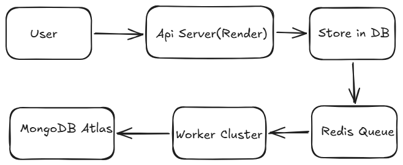

## System Architecture

## Distributed Event-Driven Notification Platform

A production-style backend infrastructure that processes notifications asynchronously using a distributed worker architecture.

This project simulates how real systems (e-commerce, banking, OTP delivery services) send reliable notifications at scale.

## Live Demo

Health Check
`https://event-driven-notification-system.onrender.com/health`

Metrics Dashboard
`https://event-driven-notification-system.onrender.com/metrics`

Queues Dashboard
`https://event-driven-notification-system.onrender.com/admin/queues`

## Architecture

Client → API Server → Store in DB → Redis Queue → Worker Cluster → Provider → Update in Database

The API only accepts requests.
Actual processing happens in background workers.

This ensures:

* Fast API response
* No request blocking
* Reliable retries

## Tech Stack

**Backend**

* Node.js
* Express.js

**Queue**

* Redis
* BullMQ

**Database**

* MongoDB Atlas

**Workers**

* Horizontally scalable background consumers

**Monitoring**

* Structured logging
* Metrics endpoint
* Health checks
* Bullmq Dasbaord(using Bull-board)

## Features

### Reliability

* Retry with exponential backoff
* Dead Letter Queue
* Automatic job recovery
* Graceful shutdown handling

### Consistency

* Idempotent consumers
* Exactly-once processing effect
* Duplicate prevention using unique index locking

### Scalability

* Multiple parallel workers
* Queue-based architecture
* Rate limiting
* Priority jobs (OTP > Transaction > Marketing)
* Batch processing

### Observability

* Success rate tracking
* Throughput measurement
* Failure inspection endpoint
* System health monitoring

##  Load Testing

System handled concurrent requests with high success rate while workers processed events asynchronously.

Metrics tracked:

* events/sec
* success rate
* failure recovery
* retry behavior

## Event Lifecycle

1. Client creates notification event
2. Event stored in DB
3. Job added to Redis queue
4. Worker picks job
5. Provider simulated (email/otp)
6. Delivery recorded
7. Metrics updated

## Key Backend Concepts Demonstrated

* Event-driven architecture
* At-least-once message queues
* Exactly-once effect via idempotency
* Distributed locking
* Background job processing
* Horizontal scaling
* Fault tolerance
* Observability

##  Running Locally

npm install
npm run dev
node src/workers/startWorkers.js

## Author

Yash Pal
Backend Developer
